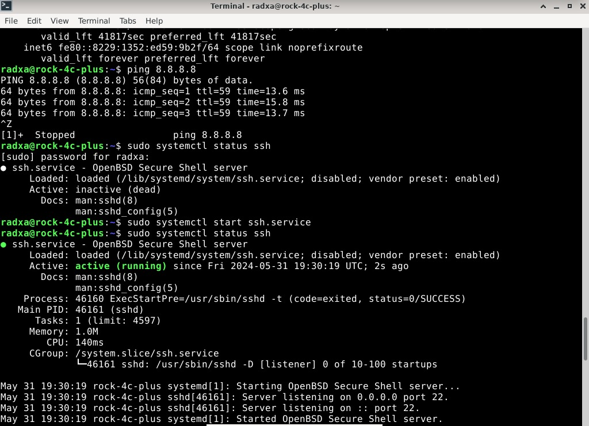
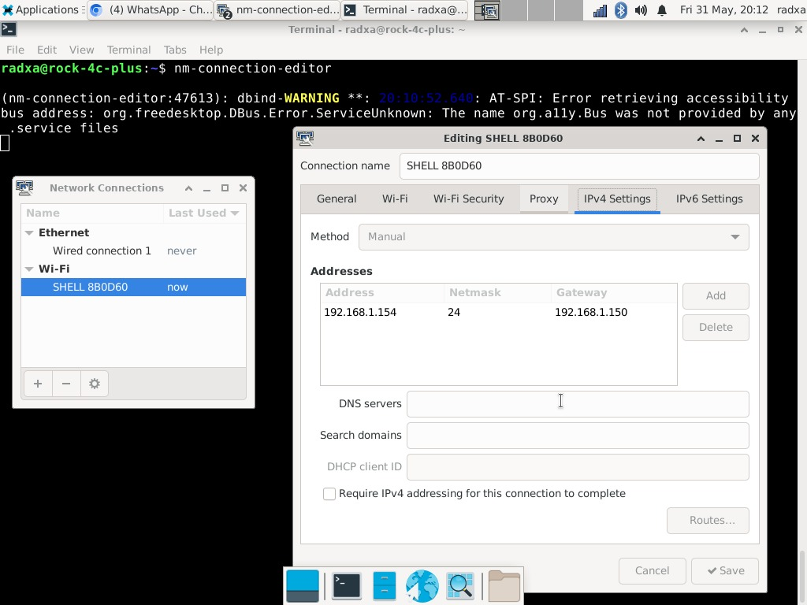
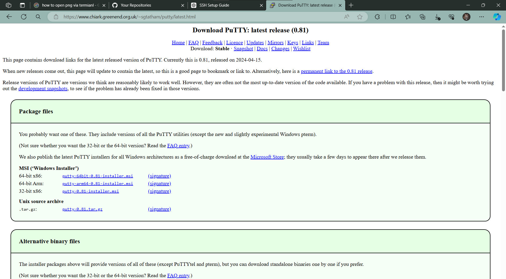
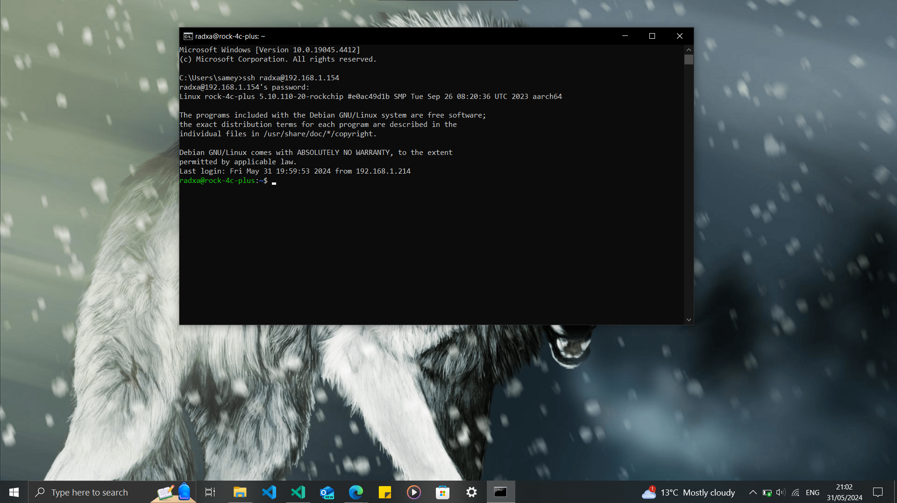
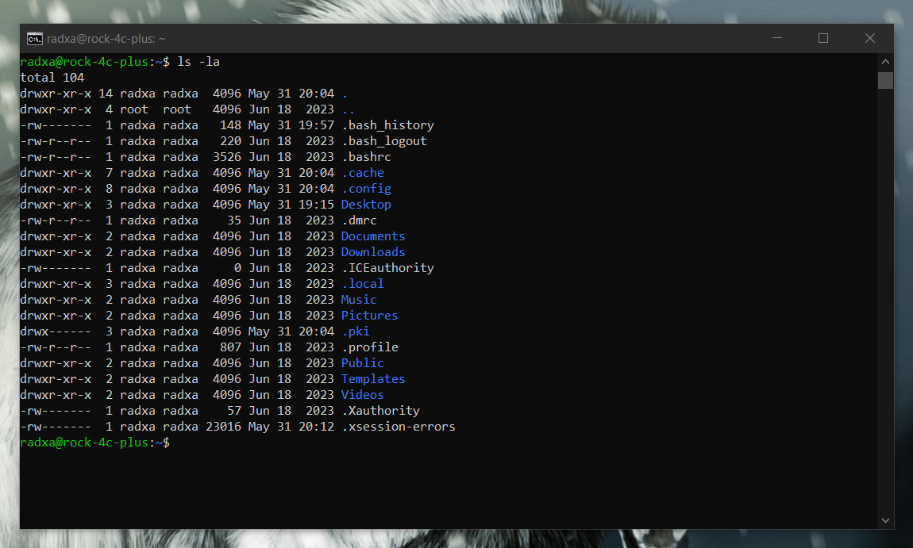

# Screenshots of Steps to Set Up SSH Connection Between Laptop and Single-Board Computer

1. **Install OpenSSH Server on Rock 4C+ and verify SSH service is Running**
   - Open terminal and install SSH server using `sudo apt install openssh-server` and enable ssh service.

    

2. **Set Static IP Address of Rock 4C+**
   - Use `nm-connection-editor` to access network setting and set static IP address of the Rock 4C+.

    

3. **Install SSH Client on Laptop**
   - On Windows, use PowerShell or PuTTY. On macOS/Linux, use the terminal.

    

4. **Connect to Rock 4C+ from Laptop**
   - Open SSH client and connect using `ssh username@192.168.1.100`.

    

5. **Verify Connection**
   - Confirm the SSH connection by accessing the Rock 4C+ terminal.

    