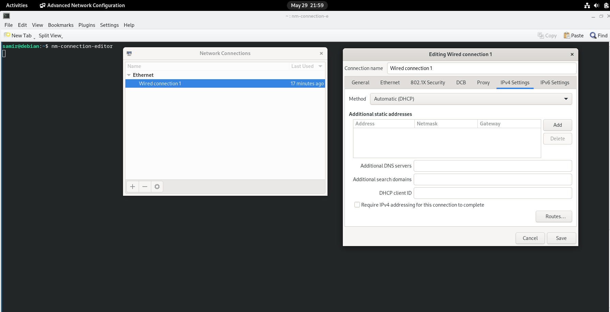
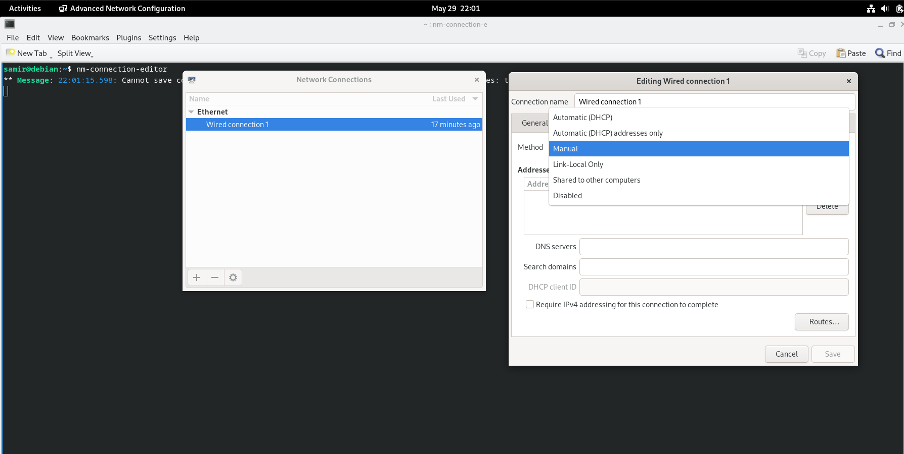
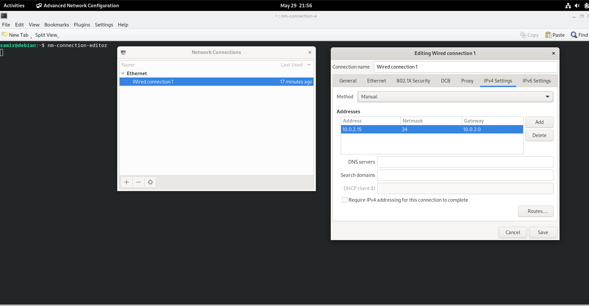
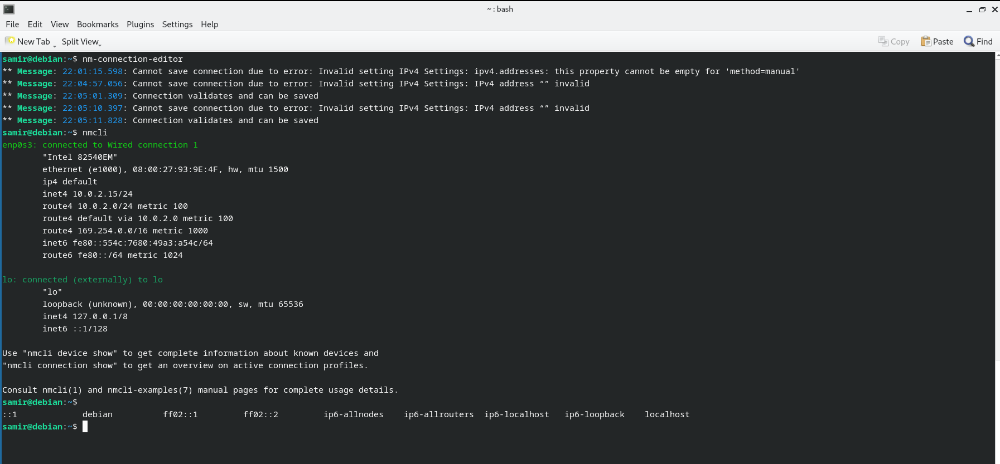

# Step-by-Step Guide to Configure a Static IP Address

1. **Access Network Settings**
    - Open the terminal and enter the command `nm-connection-editor` to access the network settings.
    - This will bring up the Network Connections editor.
    
    

2. **Change IP Configuration Method**
    - In the Network Connections editor, locate your active network connection and select it.
    - Click on the "Edit" button.
    - In the "IPv4 Settings" tab, change the method from "Automatic (DHCP)" to "Manual".
    
    

3. **Add Static IP Address**
    - Click the "Add" button next to the "Addresses" section.
    - Enter your desired static IP address, netmask, and gateway. For example:
      - Address: `192.168.1.100`
      - Netmask: `255.255.255.0`
      - Gateway: `192.168.1.1`
    - Enter the appropriate DNS servers in the "DNS servers" field.
    - Click "Save" to apply the changes.
    
    

4. **Verify the Changes**
    - Open the terminal and use either the `nmcli` command or the `ip address` command to verify that the changes have taken effect.
    - For `nmcli`, use:
      ```sh
      nmcli 
      ```
    - For `ip address`, use:
      ```sh
      ip address
      ```
    - Check that the IP address listed matches the static IP address you set.
   
   

By following these detailed steps, you can successfully configure a static IP address for your single-board computer, ensuring it remains consistent each time it connects to the network.